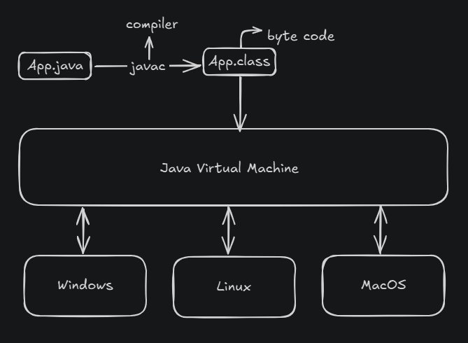

# Fundamentos de Java com DevDojo

Este repositório serve como um registro do meu progresso e da minha evolução no entendimento da base da linguagem Java, acompanhando as aulas do canal DevDojo no YouTube.

---

## Conteúdo das Aulas

### Vídeo 1: Como o Java funciona?

Nesta aula, aprendi sobre o fluxo de execução de um programa Java:



1.  Temos um arquivo `.java` (código fonte).
2.  Quando compilado, ele se transforma em um arquivo `.class` (chamado de **bytecode**).
3.  Esse arquivo bytecode é executado pela **Java Virtual Machine (JVM)**.
4.  A JVM interpreta o bytecode para o sistema operacional específico onde o programa está sendo executado.

E é daqui que vem um dos principais conceitos do Java:

> **Escreva uma vez e execute em qualquer lugar!** (Write Once, Run Anywhere - WORA)

---

### Vídeo 9: Comentários

Nesta aula, aprendi sobre as diferentes formas de adicionar comentários ao código Java:

* `//` : Comenta uma única linha.

    ```java
    // Este é um comentário de linha única
    ```

* `/* ... */` : Comenta um bloco de código.

    ```java
    /*
     * Este é um comentário
     * de múltiplas linhas.
     */
    ```

* `/** ... */` : Comentário Javadoc. Usado para gerar documentação automaticamente.

    ```java
    /**
     * Isso é um comentário Javadoc.
     * Geralmente usado para descrever classes, métodos e variáveis.
     */
    ```

---

### Vídeo 10: Tipos Primitivos

Os tipos primitivos são a base para armazenar valores simples na memória. Eles são palavras reservadas do Java:

* `int`: Armazena números inteiros (ex: 10, -500).
* `double`: Armazena números de ponto flutuante de dupla precisão (ex: 3.14159, -0.001).
* `float`: Armazena números de ponto flutuante de precisão simples (ex: 2.5f, -99.9f). **Nota:** Requer o sufixo 'f' ou 'F'.
* `char`: Armazena um único caractere (ex: 'A', '7', '$').
* `byte`: Armazena números inteiros muito pequenos (de -128 a 127).
* `short`: Armazena números inteiros pequenos (de -32,768 a 32,767).
* `long`: Armazena números inteiros muito grandes (ex: 10000000000L). **Nota:** Requer o sufixo 'L' ou 'l'.
* `boolean`: Armazena valores booleanos: `true` ou `false`.

### Vídeo 12: Casting

Casting é o processo de converter um valor de um tipo de dado para outro.
Nesta aula, aprendi sobre o casting explícito (manual), onde convertemos um tipo "maior" para um tipo "menor". 
Esse tipo de casting pode resultar em perda de dados ou precisão se o valor original for muito grande ou tiver casas decimais que não cabem no tipo de destino.
* `int age = (int) 10000000000L`;
  * Aqui eu tento colocar um `long` (10 bilhões) em um int. O `(int)` indica o casting explícito.
  * Como `10000000000L` excede o valor máximo que um `int` pode armazenar, o resulta é um overflow.
* `long bigNumber = (long) 155.23F`
  * Aqui, um `double` é explicitamente convertido para `long`.
  * A parte decimal (`.23`) será cortada, o que resulta em `155`.