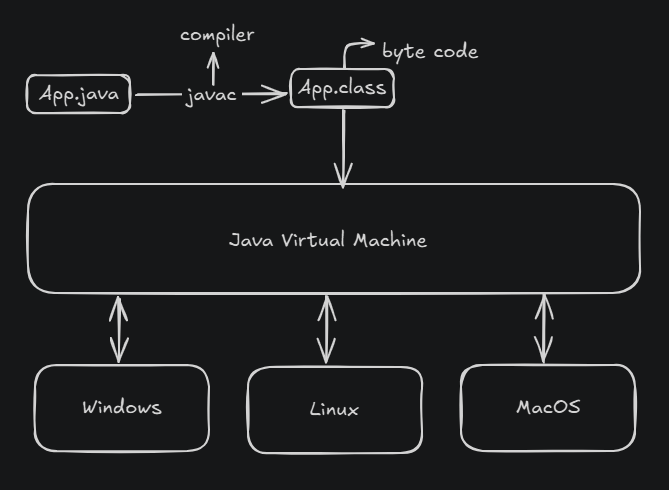

# Vídeo 01: Como o Java funciona?

Nesta aula, aprendi sobre o fluxo de execução de um programa Java:

1.  Temos um arquivo `.java` (código fonte).
2.  Quando compilado, ele se transforma em um arquivo `.class` (chamado de **bytecode**).
3.  Esse arquivo bytecode é executado pela **Java Virtual Machine (JVM)**.
4.  A JVM interpreta o bytecode para o sistema operacional específico onde o programa está sendo executado.

E é daqui que vem um dos principais conceitos do Java:

> **Escreva uma vez e execute em qualquer lugar!** (Write Once, Run Anywhere - WORA)

##### Next Class: [[Comentarios|Comentários]]