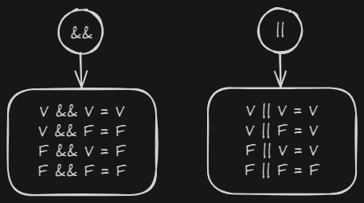

# Vídeo 23: Tabela Verdade

Nesta aula revisei sobre a tabela verdade, que é uma ferramenta fundamental em lógica e computação que mostra todos os resultados possíveis de uma operação lógica, com base nos valores de entrada (`true` ou `false`).

---
Related to: [[OperadoresLogicos|Operadores Lógicos]].
### Operador Lógico `&&` (AND)

O operador `&&` retorna `true` apenas se **todas** as condições que ele conecta forem verdadeiras.

| Operando 1 | Operando 2 | Resultado |
| :---: | :---: | :---: |
| `true` | `true` | `true` |
| `true` | `false` | `false` |
| `false` | `true` | `false` |
| `false` | `false` | `false` |

---

### Operador Lógico `||` (OR)

O operador `||` retorna `true` se **pelo menos uma** das condições que ele conecta for verdadeira. Ele só retorna `false` se ambas as condições forem falsas.

| Operando 1 | Operando 2 | Resultado |
| :---: | :---: | :---: |
| `true` | `true` | `true` |
| `true` | `false` | `true` |
| `false` | `true` | `true` |
| `false` | `false` | `false` |
